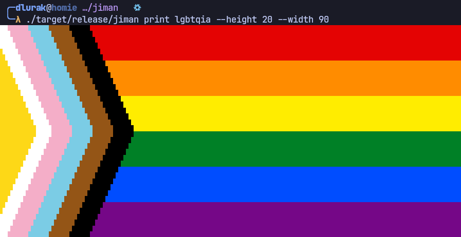

# Jiman

A simple cli to print out pride flags to the terminal.
The size and the angle of the triangle on the left can be specified using command line arguments.

The stripes have hand picked ansi colors for the tty to ensure maximal contrast.



## Installation

You can clone this repository and then run `cargo install --path ./jiman`.

### Nix

This project provides a nix flake.

```bash
nix flake show github:dlurak/jiman
```

